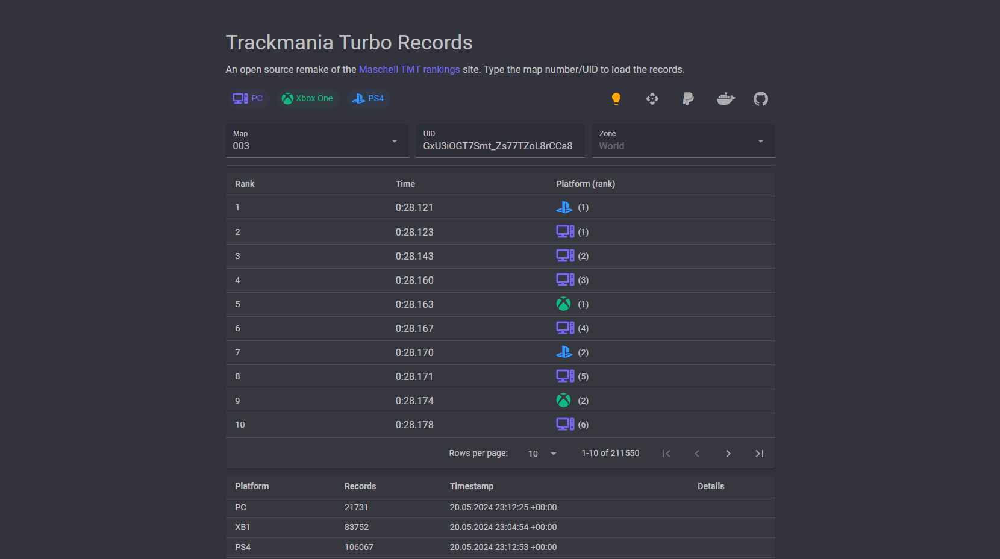

# Trackmania Turbo Records [(online)](https://tmtr.bigbang1112.cz/)

Trackmania Turbo Records (TMTR) is an open source remake of the [Maschell TMT rankings](https://maschell.de/tmt_rankings.php) website.

Written using Blazor (Auto) + MudBlazor and deployed to [Docker Hub](https://hub.docker.com/r/bigbang1112/tmturbo-records).

- Support for all 3 platforms, campaign maps, VR maps as expected
- All records, not just Top 1000
- Nicer URL support - `/{mapName or mapUid}/{zone}?p={platforms}`
- Dark/Light theme, Material Design
- *ore responsive with loading animations
- Data timestamps and error transparency
- Record Distribution Graph (still WIP)
- Any MapUid support (if master server agrees)
- API without limits
- Can be hosted by anyone
- CC0 Licensed

## Future plans

- Integrate ManiaAPI.NET 2 once it's done
- More serversided UI behaviour for better responsiveness
- Connectivity with TMT Center Spreadsheet?

## Special thanks

- Mystixor, for asking me to do this project and helping out with some requests

